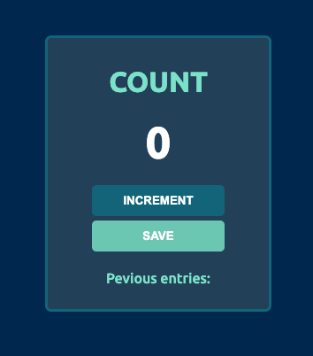

# JavaScript Counter App

This is a simple web app that can be used for counting random things and logs previous entries. This is a project build from learning tutorials to start a JavaScript journey.

## Table of contents

- [Overview](#overview)
  - [The challenge](#the-challenge)
  - [Screenshot](#screenshot)
  - [Links](#links)
- [My process](#my-process)
  - [Built with](#built-with)
  - [What I learned](#what-i-learned)
  - [Continued development](#continued-development)
  - [Useful resources](#useful-resources)
- [Author](#author)
- [Acknowledgments](#acknowledgments)

**Note: Delete this note and update the table of contents based on what sections you keep.**

## Overview

### The challenge

Users should be able to:

- View the optimal layout depending on their device's screen size
- See active states for interactive elements
- See incrementing counting from events
- See previous logs from data storing

### Screenshot




### Links

- Live Site URL: [Github](https://fdsantos300.github.io/counter-app/)

## My process

### Built with

- Semantic HTML5 markup
- CSS custom properties
- Flexbox
- JavaScript
- Mobile-first workflow
- Git

### What I learned

Basic JavaScript math operations and how manipulate DOM objects by adding events and link them to functions. Using flex properties to align objects.

To see how you can add code snippets, see below:

```html
<button id="save-btn" onclick="save()">SAVE</button>
```
```css
.main{
  display: flex;
  justify-content: center;
  align-items: center;
  flex-direction: column;
  height: 100%;
}
```
```js
function save() {
  let countStr = count + " - "
  saveEl.textContent += countStr
  countEl.textContent = 0
  count = 0
}
```

### Continued development

Looking forward to improve my Developer career by implementing new concepts and challenges.

### Useful resources

- [w3schools](https://www.w3schools.com) - This helped me on CSS refresh concepts.
- [Scrimba](https://scrimba.com/) - This is an amazing tutorial website, one of the most interactive i know out there.

## Author

- Github - [fdantos300](https://github.com/fdsantos300)
- Twitter - [@yourusername](https://www.twitter.com/yourusername)

## Acknowledgments

Built for learning purposes. Im open for collab projects, just reach me by Twitter.

Happy coding!!
